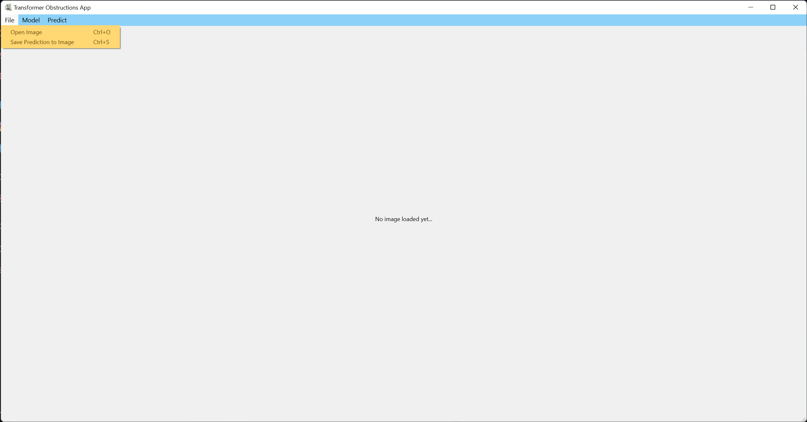
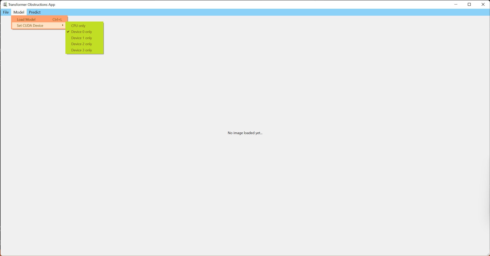
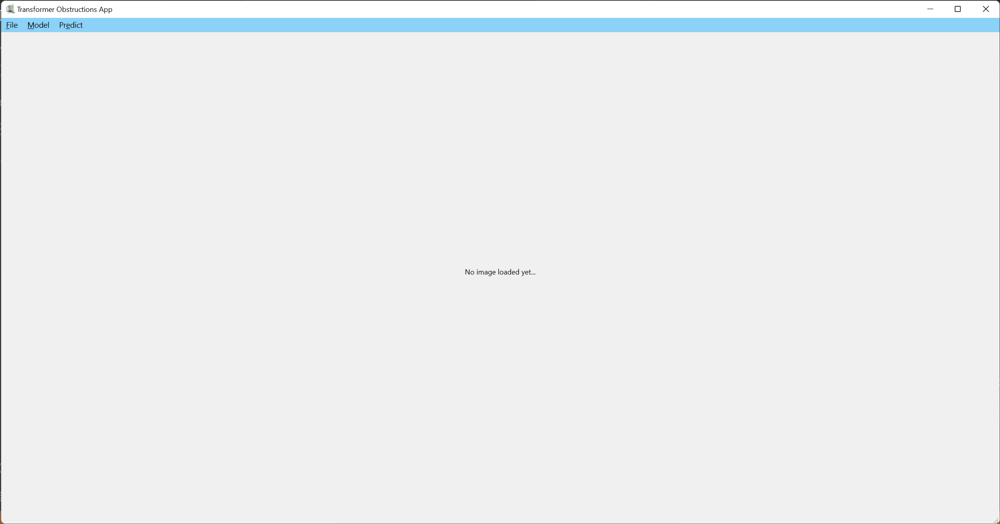

# <div align="center">YOLOv5 Inference App</div>

This application uses YOLOv5 in order to create inferences on images.


## Quick Start

<details open>
<summary>Install</summary>

Clone repo and install [requirements.txt](https://github.com/ultralytics/yolov5/blob/master/requirements.txt) in a [**Python>=3.7.0**](https://www.python.org/) environment, including [**PyTorch>=1.7**](https://pytorch.org/get-started/locally/).

```bash
git clone https://github.com/KDLPro/Roboflow-Tree-Branch-App
cd yolov5
pip install -r requirements.txt  # install
```

</details>

<details open>
<summary> Opening the App </summary>

Open the cloned repo in the command prompt and open it by using:

```bash
python main.py
```

</details>


## How to Use the App

- To load an image to be used for inference, click on <span style="color:yellow">File</span> > <span style="color:yellowgreen">Open Image</span>
or using the shortcut <span style="color:lime">Ctrl + O</span>.

<object data="[URL_to_preferred_image.png](https://github.com/KDLPro/YOLOv5-Tree-Branch-App/Documentation/file-menu.png)" type="image/png" width="800">
    
</object>

- To load a YOLOv5 model to be used for inference, go to <span style="color:yellow">Model</span> > <span style="color:yellowgreen">Load Model</span>
or using the shortcut <span style="color:lime">Ctrl + L</span>.

- Selecting a CUDA Device to be used for generating predictions can be done by going to <span style="color:yellow">Model</span> > <span style="color:yellowgreen">Set CUDA Device</span> and select the CUDA Device to be used. The app loads the CUDA device in the following order:
  - Selected CUDA Device
  - CUDA Device 0 if the selected CUDA Device does not exist.
  - CPU if no CUDA Device exists.

- When the app starts, it automatically uses CUDA Device 0. 
If no CUDA Device is found at app startup, the app uses the CPU instead to generate predictions.

<object data="[URL_to_preferred_image.png](https://github.com/KDLPro/YOLOv5-Tree-Branch-App/Documentation/model-menu.png)" type="image/png" width="800">
    
</object>

- After loading the image and model, the predictions can be made on the loaded image by clicking on <span style="color:yellow">Predict</span> > <span style="color:yellowgreen">Do Prediction</span> or using the shortcut <span style="color:lime">Ctrl + R</span>.

<object data="[URL_to_preferred_image.png](https://github.com/KDLPro/YOLOv5-Tree-Branch-App/Documentation/predict-menu.png)" type="image/png" width="800">
    
</object>

- After creating the predictions, you can save the predictions as image by going to <span style="color:yellow">File</span> > <span style="color:yellowgreen">Save Predictions as Image</span> or using the shortcut <span style="color:lime">Ctrl + S</span>. Images can be saved in the following formats: [PNG](https://en.wikipedia.org/wiki/Portable_Network_Graphics), [BMP](https://en.wikipedia.org/wiki/BMP_file_format), [JPEG or JPG](https://en.wikipedia.org/wiki/JPEG).
